```
                   ╭────────────────────────────────╮
                   │ • • •   index.js               │
                   ├────────────────────────────────┤
     )  )  )       │ 1  const coffee = 1;           │
    (  (  (        │ 2  while (alive) {             │
  ╭──────────╮     │ 3    code(coffee);             │  ┏━━━━━━━━━━━━┓
  │░░░░░░░░░░│──╮  │ 4    coffee--;                 │  ┃ Coding...  ┃
  │▒▒▒▒▒▒▒▒▒▒│  │  │ 5    sleep(0);                 │  ┗━━━━━━━━━━━━┛
  │▓▓▓▓▓▓▓▓▓▓│──╯  │ 6  }                           │
  ╰╮        ╭╯     │ 7  █                           │
   ╰────────╯      │                                │
 ═════════════════ ╰────────────────────────────────╯
```
